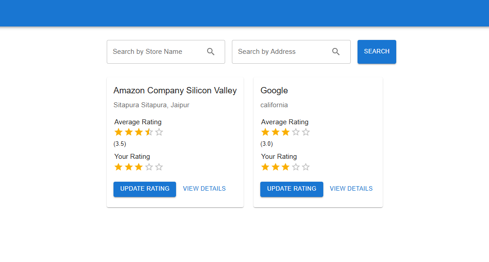
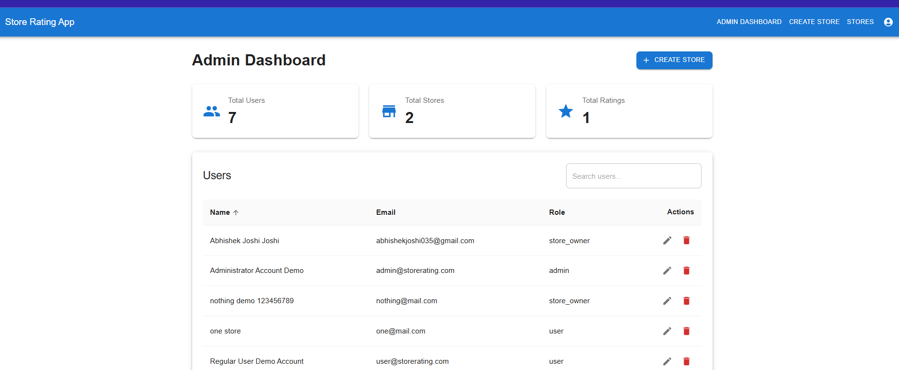

# Store Rating Application

A full-stack web application for managing stores and their ratings. The application supports multiple user roles (admin, store owner, customer) and provides features for store management and rating.

## Features

- User Authentication and Authorization
- Multiple User Roles (Admin, Store Owner, Customer)
- Store Management
- Rating System
- Responsive Design
- Sortable Tables
- Dashboard Analytics

## Application Screenshots

### Store Listing Page


The store listing page shows all registered stores with their ratings. Users can:

- Search stores by name or address
- View average ratings
- Update their own ratings
- Access detailed store information

### Admin Dashboard


The admin dashboard provides an overview of:

- Total number of users
- Total number of stores
- Total ratings
- User management with role-based access control

## Tech Stack

### Frontend

- React with Vite
- Material-UI (MUI) for UI components
- React Router for navigation
- Axios for API calls

### Backend

- Node.js
- Express.js
- PostgreSQL with Sequelize ORM
- JWT for authentication

## Database Schema

```sql
-- Users Table
CREATE TABLE Users (
    id SERIAL PRIMARY KEY,
    name VARCHAR(255) NOT NULL,
    email VARCHAR(255) UNIQUE NOT NULL,
    password VARCHAR(255) NOT NULL,
    role VARCHAR(50) NOT NULL CHECK (role IN ('admin', 'store_owner', 'customer')),
    createdAt TIMESTAMP DEFAULT CURRENT_TIMESTAMP,
    updatedAt TIMESTAMP DEFAULT CURRENT_TIMESTAMP
);

-- Stores Table
CREATE TABLE Stores (
    id SERIAL PRIMARY KEY,
    name VARCHAR(255) NOT NULL,
    email VARCHAR(255) UNIQUE NOT NULL,
    address TEXT NOT NULL,
    ownerId INTEGER REFERENCES Users(id),
    averageRating DECIMAL(3,2),
    createdAt TIMESTAMP DEFAULT CURRENT_TIMESTAMP,
    updatedAt TIMESTAMP DEFAULT CURRENT_TIMESTAMP
);

-- Ratings Table
CREATE TABLE Ratings (
    id SERIAL PRIMARY KEY,
    userId INTEGER REFERENCES Users(id),
    storeId INTEGER REFERENCES Stores(id),
    rating INTEGER CHECK (rating >= 1 AND rating <= 5),
    comment TEXT,
    createdAt TIMESTAMP DEFAULT CURRENT_TIMESTAMP,
    updatedAt TIMESTAMP DEFAULT CURRENT_TIMESTAMP,
    UNIQUE(userId, storeId)
);
```

## Setup Instructions

### Prerequisites

- Node.js (v14 or higher)
- PostgreSQL (v12 or higher)
- npm or yarn

### Backend Setup

1. Clone the repository:

```bash
git clone <repository-url>
cd store-rating-app
```

2. Install backend dependencies:

```bash
cd backend
npm install
```

3. Create a `.env` file in the backend directory:

```env
PORT=5000
DB_HOST=localhost
DB_USER=your_db_user
DB_PASS=your_db_password
DB_NAME=store_rating_db
JWT_SECRET=your_jwt_secret
```

4. Create the database:

```bash
psql -U postgres
CREATE DATABASE store_rating_db;
```

5. Run database migrations:

```bash
npx sequelize-cli db:migrate
```

6. Start the backend server:

```bash
npm run dev
```

### Frontend Setup

1. Navigate to the frontend directory:

```bash
cd frontend-vite
```

2. Install frontend dependencies:

```bash
npm install
```

3. Create a `.env` file in the frontend directory:

```env
VITE_API_URL=http://localhost:5000/api
```

4. Start the frontend development server:

```bash
npm run dev
```

The application will be available at `http://localhost:5173`

## User Roles and Permissions

### Admin

- Manage all users
- Create/Edit/Delete stores
- View all ratings
- Access admin dashboard

### Store Owner

- Manage their own store
- View store ratings
- Access store dashboard

### Customer

- View stores
- Rate stores (one rating per store)
- Edit/Delete their own ratings

## API Endpoints

### Authentication

- POST /api/auth/register
- POST /api/auth/login

### Users

- GET /api/users
- GET /api/users/:id
- PUT /api/users/:id
- DELETE /api/users/:id

### Stores

- GET /api/stores
- GET /api/stores/:id
- POST /api/stores
- PUT /api/stores/:id
- DELETE /api/stores/:id

### Ratings

- GET /api/stores/:id/ratings
- POST /api/stores/:id/ratings
- PUT /api/ratings/:id
- DELETE /api/ratings/:id

## Contributing

1. Fork the repository
2. Create your feature branch (`git checkout -b feature/AmazingFeature`)
3. Commit your changes (`git commit -m 'Add some AmazingFeature'`)
4. Push to the branch (`git push origin feature/AmazingFeature`)
5. Open a Pull Request

## License

This project is licensed under the MIT License - see the LICENSE file for details
